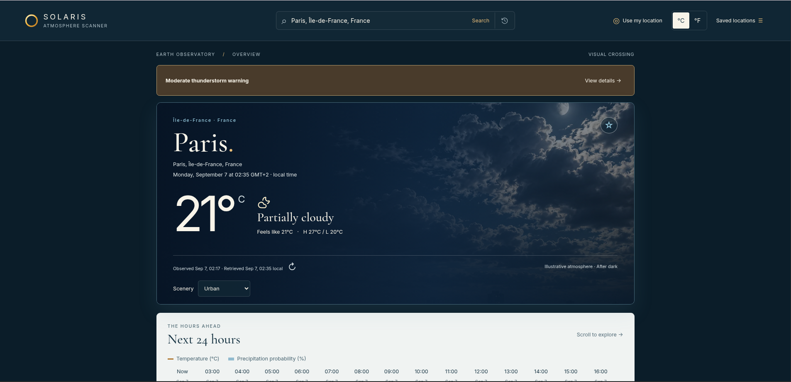

# Solaris Atmosphere Scanner

> A refined Earth-weather observatory for searching locations, reading live atmospheric conditions, and planning the days ahead.

[Live demo](https://progritit.github.io/weather_app/) · [Source repository](https://github.com/progritit/weather_app)



## Overview

Solaris Atmosphere Scanner is a responsive weather application built for [The Odin Project's Weather App assignment](https://www.theodinproject.com/lessons/node-path-javascript-weather-app). It combines a practical forecast workflow with a warm, editorial Solaris visual identity: atmospheric blue surfaces, luminous ivory type, restrained amber accents, and weather imagery that adapts to local conditions and day/night.

The application accepts a city, address, postal code, or the user's coordinates. It resolves the location, presents the current conditions in the location's own timezone, and keeps the next 24 hours and seven-day forecast available in one coordinated view.

## Features

- **Location search:** Submit a city, address, or postal code through an accessible search form. Local suggestions use accent-insensitive ranking, region/country matching, and a small typo tolerance; unlisted locations can still be submitted to the provider.
- **Current conditions:** View the resolved city, administrative context, local date/time, temperature, condition, feels-like temperature, daily high/low, update source, and retrieval timestamp.
- **Forecast planning:** Explore the next 24 hours with temperature and precipitation-probability data, then select a day in the seven-day forecast to open its detailed view.
- **Weather details:** Read humidity, wind speed/direction/gusts, UV index, visibility, pressure, precipitation, sunrise, sunset, and provider-supplied weather alerts when available.
- **Responsive atmosphere:** Weather condition codes and local day/night determine the icon, palette, and atmospheric scene. Urban, countryside, and coastal scenery can be selected without implying a live camera feed.
- **Saved locations:** Add, remove, select, and set a default location. Recent searches, saved places, scenery, and °C/°F preferences persist in the browser.
- **Use my location:** Request coordinates through the browser Geolocation API, then query weather through the same protected endpoint. A manual-search fallback remains available when permission is denied or location access fails.
- **Resilient states:** Initial loading, refresh loading, invalid locations, unavailable service, rate limits, network failure, missing readings, fresh cache, and stale cache all have explicit user feedback and recovery actions.
- **Accessible interaction:** Visible focus states, keyboard-operable combobox and forecast controls, screen-reader announcements, semantic chart tables, large touch targets, and reduced-motion support are included.

## Data and privacy boundary

The browser never calls Visual Crossing directly and never receives the provider key. Requests follow this path:

```text
Browser → Cloudflare Worker (/api/weather) → Visual Crossing Timeline API
```

The Worker validates the location input, fixes the upstream request shape, adds the secret stored in Cloudflare, applies CORS, rate limits and caching, and returns a safe `{ data, meta }` envelope. The application normalizes that envelope into its own model and keeps missing readings as unavailable values rather than inventing zeros.

The local development secret belongs in `worker/.dev.vars`, which is ignored by Git. Production credentials belong in Cloudflare Worker secrets. A frontend `.env` file, Webpack substitution, or GitHub secret injected into a browser build would still expose a key to users.

The Worker currently applies these protections:

| Protection            | Policy                                                                   |
| --------------------- | ------------------------------------------------------------------------ |
| Caller requests       | 20 requests per minute per IP and Cloudflare location                    |
| Provider calls        | 5 requests per minute across cache misses per Cloudflare location        |
| Provider/cache window | Fixed metric current, hourly, daily, and alert sections; 10-minute cache |
| Upstream timeout      | 10 seconds, including response-body reading                              |
| Response size         | 2 MiB maximum                                                            |

These limits reduce accidental usage and abuse; they are not a global spending cap. Check the Visual Crossing plan and Cloudflare account usage before production use.

## Built with

- **HTML5** and semantic document structure
- **CSS3** with custom properties, Grid, Flexbox, responsive breakpoints, and reduced-motion rules
- **Vanilla JavaScript** with ES modules, `async`/`await`, `AbortController`, and dynamic icon imports
- **Webpack 5** for development, production bundling, and asset emission
- **Visual Crossing Timeline API** for weather data
- **Cloudflare Workers** for the protected weather proxy
- **`localStorage`** for preferences, recent searches, saved locations, and bounded weather cache
- **ESLint, Prettier, Node's test runner, and Semgrep** for quality checks

## Project structure

```text
weather_app/
├── assets/
│   ├── branding/              Solaris mark and favicon assets
│   ├── fonts/                 Cormorant Garamond and Inter
│   ├── icons/                 UI and weather icon sources
│   ├── images/weather/        Coastal, urban, and countryside scenes
│   └── licenses/              Asset provenance and third-party licenses
├── src/
│   ├── api/weather.js         Browser client for the protected endpoint
│   ├── data/                  Normalization, forecast selection, location index
│   ├── search.js              Search, geolocation, caching, and request races
│   ├── state.js               In-memory application state
│   ├── storage.js             Preferences, saved places, recent searches, cache
│   ├── ui/                    Current view, forecasts, charts, status, footer
│   └── utils/                 Dates, units, locations, conditions, and escaping
├── worker/
│   ├── index.mjs              Separate Cloudflare Worker proxy
│   ├── test/                  Worker security and behavior tests
│   └── wrangler.jsonc         Deployment settings and protection bindings
├── src/template.html          Webpack document shell
├── webpack.common.js          Shared Webpack configuration
├── webpack.dev.js             Development server configuration
└── webpack.prod.js            Production configuration
```

The Worker is a separate npm project and is never imported into the browser bundle.

## Run locally

### Prerequisites

Use Node.js 22 or newer. The frontend and Worker have separate lockfiles and dependency installations.

### Install

```bash
git clone https://github.com/progritit/weather_app.git
cd weather_app
npm ci
npm --prefix worker ci
```

### Start the local Worker

Create the ignored local variables file and add your own Visual Crossing key:

```bash
cp worker/.dev.vars.example worker/.dev.vars
```

Edit `worker/.dev.vars` so it contains your local key. Keep this file private. Then start the Worker:

```bash
npm --prefix worker run dev
```

The local proxy listens on `http://localhost:8787`.

### Start the frontend

In a second terminal, from the application root:

```bash
npm run dev
```

Open `http://localhost:8080`. The frontend automatically uses the local Worker on localhost and the configured deployed Worker on other hosts. The local Worker configuration allows the development origin and starts with weather access enabled through `.dev.vars`.

## Production Worker deployment

The deployment guide in [`STEP-04.md`](./STEP-04.md) contains the full quota, secret, CORS, and release procedure. The essential sequence is:

1. Set exact frontend origins in `worker/wrangler.jsonc` and leave `WEATHER_ENABLED` set to `"false"` for the first deployment.
2. From `worker/`, authenticate and deploy the disabled Worker.
3. Add the provider key with `npx wrangler secret put VISUAL_CROSSING_API_KEY`; never place the value in `wrangler.jsonc`, source code, or frontend build settings.
4. Set `WEATHER_ENABLED` to `"true"`, deploy again, and verify the reported `workers.dev` URL.
5. Confirm the frontend's `src/api/weather.js` endpoint and the production CORS origin before publishing the frontend bundle.

## Quality checks

Run the frontend checks from the project root:

```bash
npm run lint
npm run format:check
npm run build
find src -name '*.test.mjs' -print0 | xargs -0 node --test
```

Run the Worker checks separately:

```bash
npm --prefix worker test
npm --prefix worker run build
```

The combined project gate is:

```bash
npm run check
```

Security scans are available through `npm run security`, `npm run security:strict`, and `npm run security:deps`.

## Design and accessibility notes

The primary experience is intentionally visual, but weather information remains readable without relying on imagery or color alone. Charts expose a table alternative with explicit units, every state has text feedback, and missing values use an em dash or an unavailable label. Provider alert text is escaped before rendering and is shown only when supplied and active.

The atmospheric artwork is generic illustrative scenery. It does not represent a live observation, a specific city, radar coverage, air-quality measurements, minute-by-minute rain predictions, or AI-generated advice.

## Assets and attribution

- Weather data: [Visual Crossing Timeline API](https://www.visualcrossing.com/weather-api/)
- Weather and interface icon geometry: [Lucide](https://lucide.dev/), with license information in [`assets/licenses/lucide-isc.txt`](./assets/licenses/lucide-isc.txt)
- Social GitHub and LinkedIn icons: [Bootstrap Icons](https://icons.getbootstrap.com/), MIT license notice in [`src/ui/footer.js`](./src/ui/footer.js)
- Typography: [Cormorant Garamond](https://fonts.google.com/specimen/Cormorant+Garamond) and [Inter](https://fonts.google.com/specimen/Inter), with local license files in `assets/licenses/`
- Atmospheric scenes: project-specific generic artwork; provenance is documented in [`assets/licenses/asset-provenance.md`](./assets/licenses/asset-provenance.md) and [`assets/licenses/landscape-provenance.md`](./assets/licenses/landscape-provenance.md)

## Author

**Clebson Web Dev**

[GitHub](https://github.com/progritit) · [LinkedIn](https://www.linkedin.com/in/clebsoncosta/)

Built as part of my ongoing [The Odin Project](https://www.theodinproject.com/) web-development curriculum and Solaris portfolio universe.

## License

The project code is available under the [MIT License](./LICENSE). Third-party fonts and icon assets retain the licenses documented in `assets/licenses/`.
